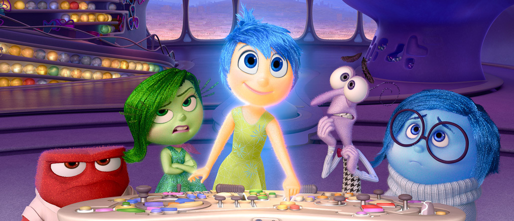
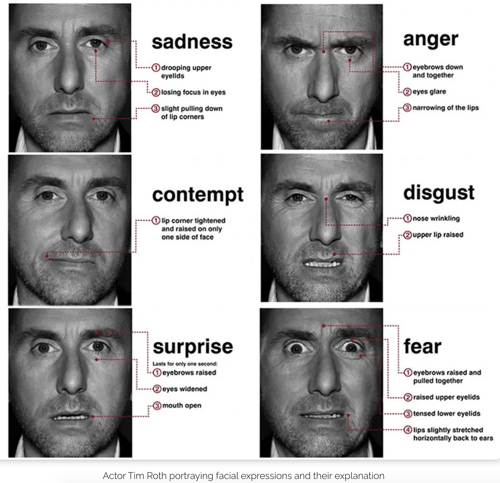
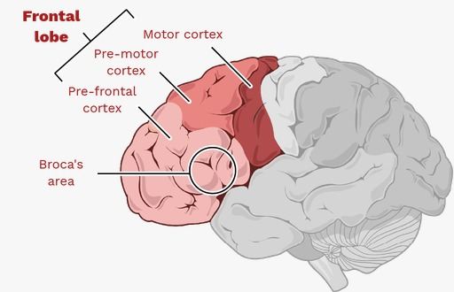

With Inside Out 2 steaming in the theaters, I take the opportunity to talk about how psychologists and neuroscientists model human emotions. Let's get started!



Disney-Pixar's Inside Out offers a fascinating glimpse into the science of human emotions and is one of my favorite animated films. The emotions (joy, sadness, fear, disgust, anger, fear; envy, embarrassment, ennui) are the main characters of the film, but where do they come from? What is the science behind these animated emotions? Let's take a look at Paul Ekman's model of emotions.

Psychologist Paul Ekman is renowned for his work on the universality of emotions and facial expressions. His research identifies six basic emotions that are universally recognized across cultures: happiness, sadness, fear, anger, surprise, and disgust. These core 6 emotions are hardwired into our brains and are expressed through specific facial expressions and physiological responses. Consequently, creators of Inside Out got in touch with the Paul Ekman team to talk about their idea of portraying emotions in a movie. And that's how it all started.



> Everyone knows what an emotion is, until asked to give a definition.
>
> Fehr and Russell [1984]

What is emotion? Many people would describe emotion as a 'feeling', 'mood' or 'affective state' of a person. But feeling refers to the experiential part of an emotion, while affect is a broader concept about someone's well-being, and mood is a temporary state of being. In fact, emotion is more complex than the definitions we would come up with. Gross and Thompson (2007) classify emotions as typically having specific objects and triggering actions related to those objects. For example, anger is directed at a person or thing and motivates action to remove the source of irritation. Emotions can be either positive or negative; for example, anger at being scolded is negative, whereas happiness at winning a game is positive (Steunebrink, 2010).

So, if you've seen either of the Inside Out movies, you'll notice that these characteristics of emotions closely align with how emotions are portrayed in the films. In the second film, however, we encounter more than the original six core emotions. As the main character grows up, she experiences more nuanced emotions like anxiety, envy, embarrassment, ennui, and nostalgia. Emotions become increasingly complex with age and new experiences, and we express them through both language and facial expressions. Google's _GoEmotions_ research can guide you in understanding how different emotions are mapped through language.

<div className="mt-12"></div>

```json
{
  "anger": ["anger", "annoyance", "disapproval"],
  "disgust": ["disgust"],
  "fear": ["fear", "nervousness"],
  "joy": ["joy", "amusement", "approval", "excitement", "gratitude", "love", "optimism", "relief", "pride", "admiration", "desire", "caring"],
  "sadness": ["sadness", "disappointment", "embarrassment", "grief", "remorse"],
  "surprise": ["surprise", "realization", "confusion", "curiosity"]
}
```


<div className="text-center italic">
from goemotions dataset of Ekman mapping of emotions
</div>

### We are all guided by our emotions

There is a common belief in society that being emotional is the opposite of being rational. However, is this really the case? Neuropsychological evidence shows that emotions are essential for decision-making. This necessity is highlighted by research on patients with frontal lobe damage. (The frontal lobe, especially the prefrontal cortex, is known to be involved in the regulation and processing of emotions.) Patients with frontal lobe damage experience poor decision-making and struggle with social judgment due to their inability to feel emotions, which impairs their ability to evaluate outcomes and avoid socially damaging choices. 



For example, studies show that when we are angry, we become more sensitive to what is unfair, which helps us to take action to remedy the injustice. Thus, emotions are integral to making sensible decisions, and make moral judgements of right and wrong. This is also reflected in the film, as her emotions help her to understand the situation she finds herself in:

> “Sadness gradually takes control of Riley’s thought processes about the changes she is going through. This is most evident when Sadness adds blue hues to the images of Riley’s memories of her life in Minnesota.” (Keltner, 2015) 

Scientific research shows that our present emotions influence our memories of the past. In the film, this crucial role is embodied by Sadness, which helps Riley acknowledge her current changes and losses, thereby setting the stage for her to develop new aspects of her identity. So, _“emotions organize - rather than disturb”_, contrary to the notion that they are purely irrational. 

I hope this short essay provides you with a basic understanding of how emotions work and the foundation of the film. The next time you watch Inside Out, think about how each character embodies a particular emotion and how those emotions align with Paul Ekman's scientific research. Our inner world and our linguistic and facial expressions of emotions are complex and rich, and I think Inside Out does a good job of reflecting the multimodality of emotions to the audience. 

#### References:
- https://disney.fandom.com/wiki/The_Emotions 
- https://www.paulekman.com/blog/the-science-of-inside-out/ 
- https://www.envisionyourevolution.com/evolution-emotion/paul-ekman-theory-of-emotion/2149/ 
- https://github.com/google-research/google-research/tree/master/goemotions 
- https://dspace.library.uu.nl/handle/1874/43581 
- https://theory.labster.com/frontal-lobe/ 

__tags:__ psychology, linguistics, neuropsychology, emotions, insideout 
